# Transcrição_de_Caligrafia

## Descrição 📝

Projeto para transcrição de caligrafia utilizando redes neurais convolucionais e recorrentes. o projeto foi baseado no projeto [Handwriting words recognition with PyTorch (OCR) ](https://pylessons.com/handwriting-recognition-pytorch) do site [PyLessons](https://pylessons.com/).

O trabalho foi desenvolvido utilizando a linguagem de programação Python e a biblioteca PyTorch. O dataset utilizado foi uma base com 26252 imagens de manuscritos de alunos do ensino fundamental onde se tem um arquivo csv com dados como ID e label da imagem e entre outros dados para cada imagem.

Foi feito um pré-processamento nas imagens para que elas ficassem com o mesmo tamanho e também foi criado um novo arquivo csv que contem o caminho das imagens e o texto que está escrito na imagem para facilitar o treinamento do modelo. Foi utilizado somente as imagens que tinham como UserRole == 'PARTICIPANTBR' que eram imagens de palavras e frases manuscritas dos alunos os outros tipos de imagens foram descartados pois não eram números para fins matemáticos.

Foi dividido o dataset em 90% para treino e 10% para teste. O modelo foi treinado com 200 épocas e o modelo com melhor acurácia foi salvo para ser utilizado na transcrição de texto. O modelo foi treinado com o algoritmo Adam e com a função de perda CTC Loss.

As imagens de teste foi salva em um arquivo csv com o caminho das imagens e o texto que está escrito na imagem e o de traino também foi salvo em um arquivo para fins de verificações de quais imagens foram utilizadas para treino e teste.

O modelo obteve uma acurácia de 0.32 com o dataset de teste.

## Instalação 📥

Para instalar as dependências do projeto basta executar o comando abaixo:

```bash
pip install -r requirements.txt
```

## Execução 🏃‍♂️

Para executar o projeto precisamos passar por 2 etapas, primeiro precisamos treinar o modelo e depois executar o modelo treinado para transcrever o texto. Para treinar o modelo basta executar o notebook `train.ipynb` que se encontra no caminho `./manuscrito_alunos/train.ipynb`. Para executar o modelo treinado basta executar o notebook `predict.ipynb` que se encontra no caminho `./manuscrito_alunos/predict.ipynb`.

## Observações 📊

- no arquivo `text_utils.py` d a biblioteca `utils` foi modificado a função de retorno para retornar 2 parâmetros `cer` que seria a media de erros e `distance` que seria a distancia entre as palavras do texto e as palavras transcritas.

## Imagens com suas previsões 📷

| 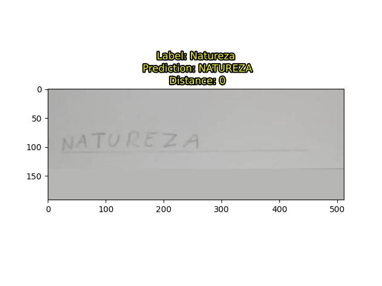  | 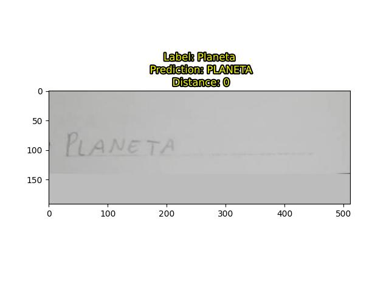  | 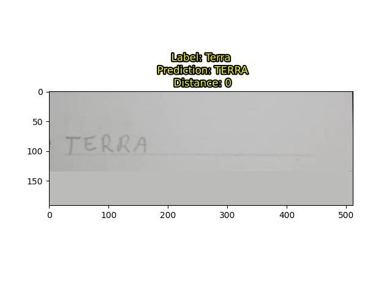  | 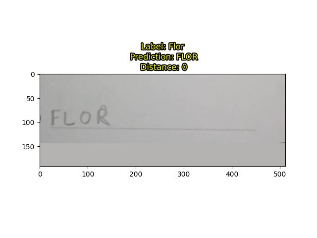  |
| --------------------------------------- | --------------------------------------- | --------------------------------------- | --------------------------------------- |
| 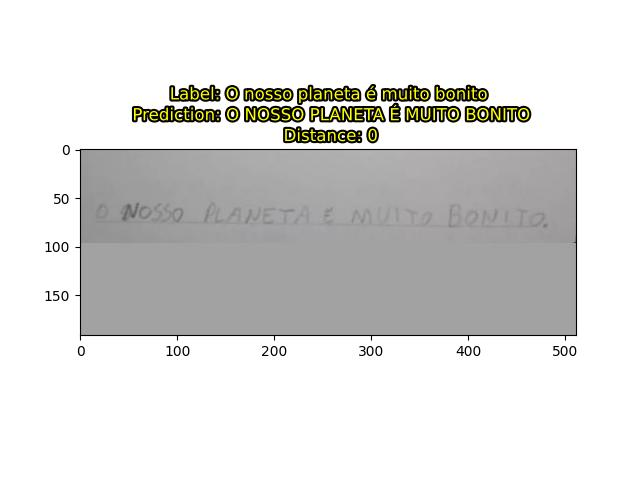  | 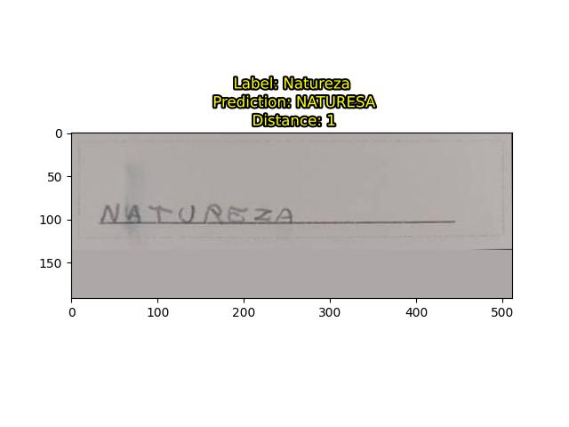  | 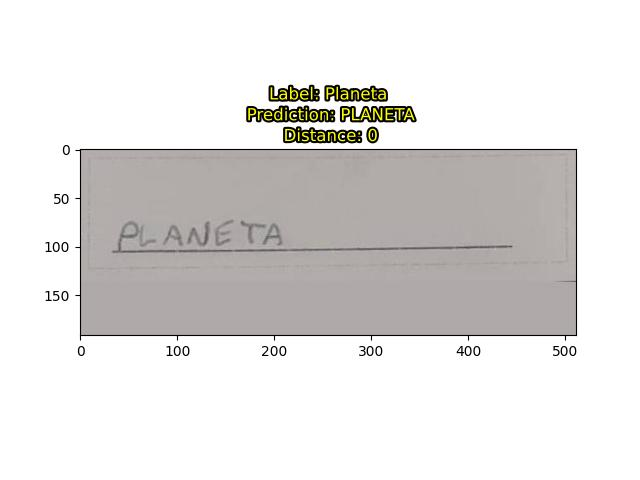  | 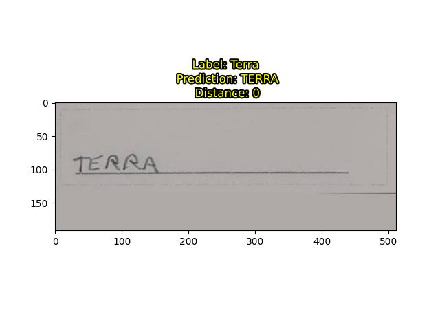  |
| 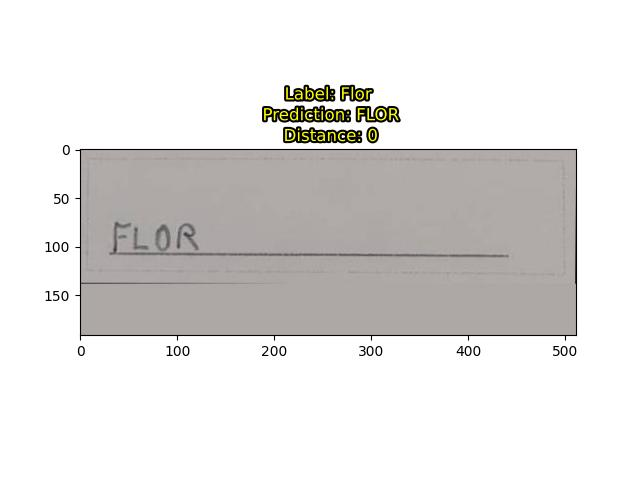  | 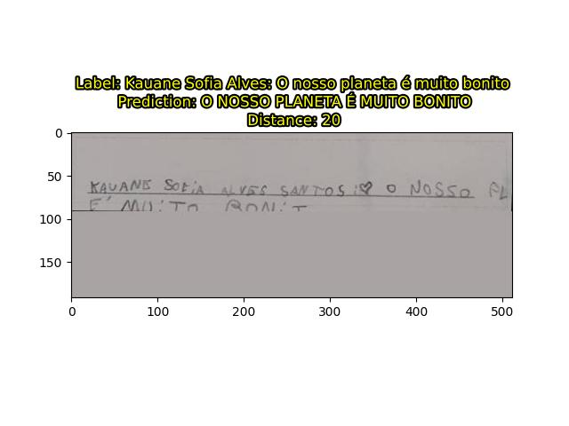 | 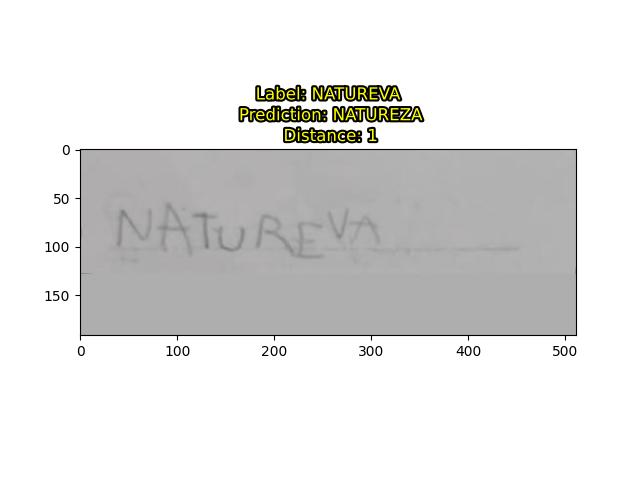 | 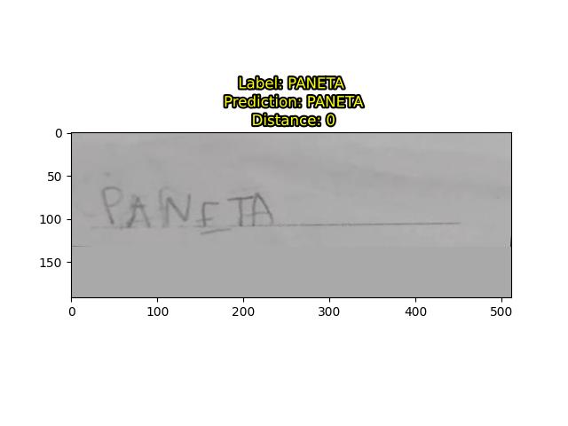 |
| 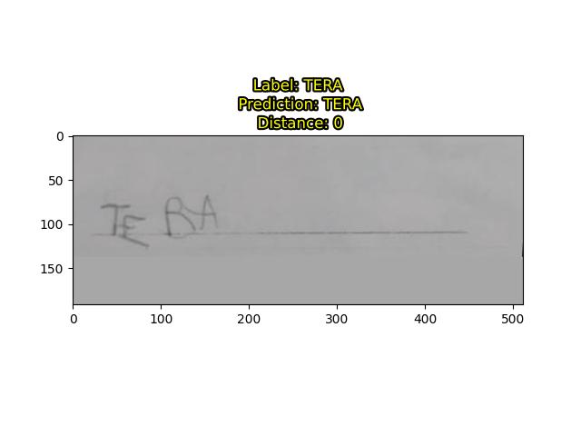 | 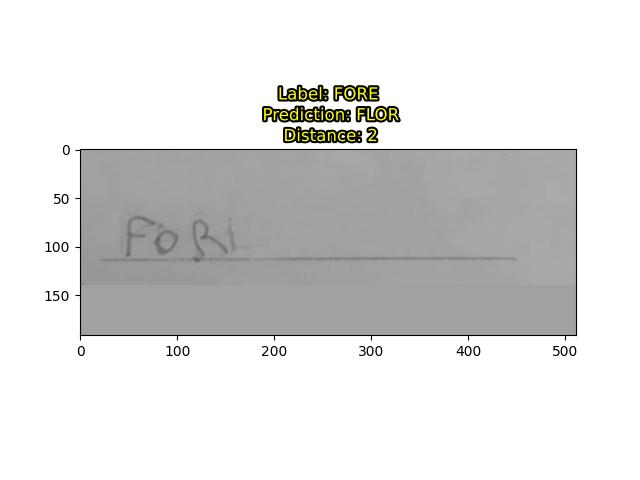 | 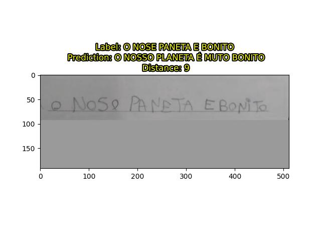 | 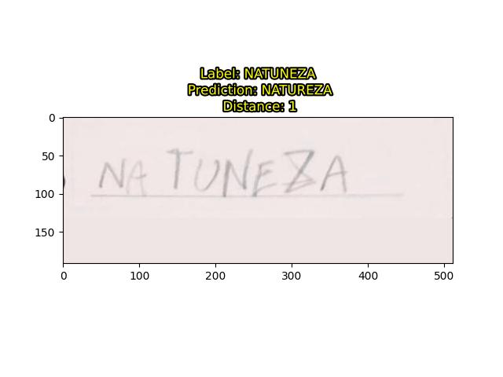 |
